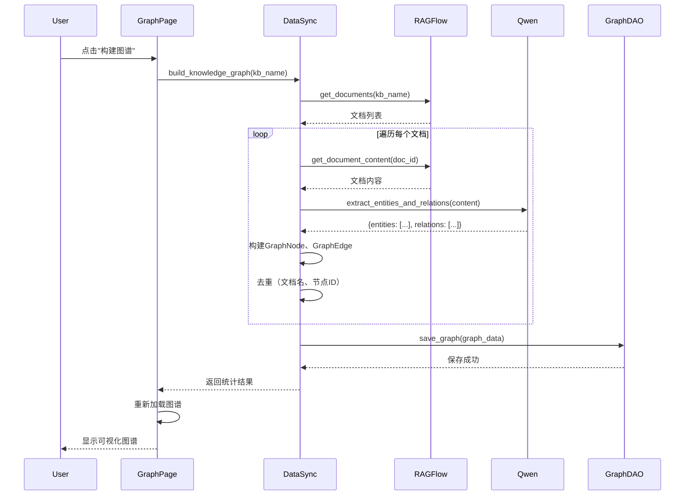
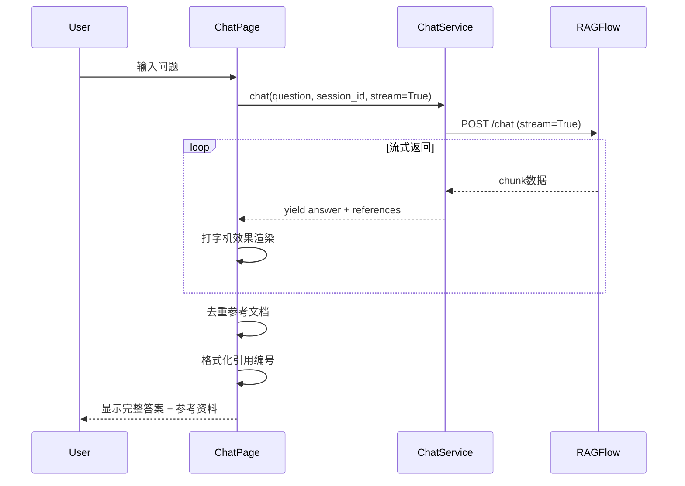
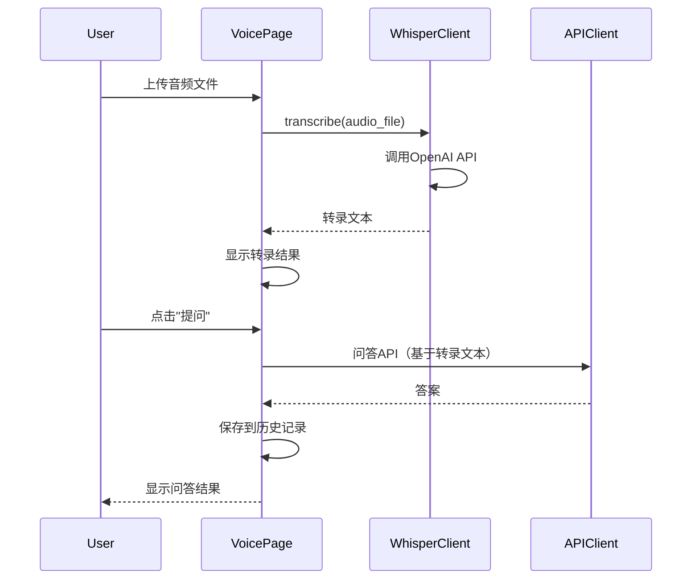
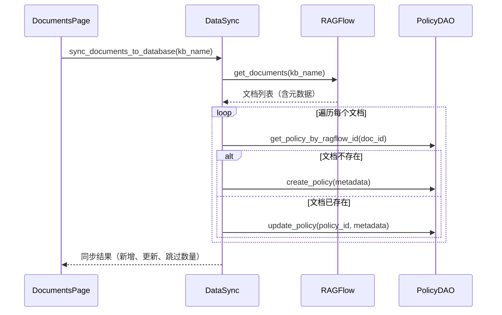

# 🏗️ 系统架构

> 政策知识库系统的整体架构设计  
> 阅读时间: 15分钟

---

## 📋 目录

- [架构概览](#架构概览)
- [技术栈](#技术栈)
- [分层架构](#分层架构)
- [核心流程](#核心流程)
- [数据流](#数据流)
- [部署架构](#部署架构)
- [扩展性设计](#扩展性设计)

---

## 🎯 架构概览

### 系统定位
政策知识库是一个基于RAG（检索增强生成）的智能政策问答和分析平台：

```
┌─────────────────────────────────────────────────────────────┐
│                      Web界面 (Streamlit)                      │
├─────────────────────────────────────────────────────────────┤
│  搜索  │  聊天  │  图谱  │  语音  │  文档  │  分析  │
└─────────────────────────────────────────────────────────────┘
         ↓               ↓               ↓
┌─────────────────┐ ┌──────────────┐ ┌──────────────┐
│   业务逻辑层     │ │   服务层     │ │  数据访问层   │
│                 │ │              │ │              │
│ ValidityChecker │ │ RAGFlowClient│ │  PolicyDAO   │
│ ImpactAnalyzer  │ │ QwenClient   │ │  GraphDAO    │
│ TagGenerator    │ │ ChatService  │ │ DBManager    │
│ MetadataExtract │ │ DataSync     │ │              │
└─────────────────┘ └──────────────┘ └──────────────┘
         ↓               ↓               ↓
┌─────────────────────────────────────────────────────────────┐
│                        数据层                                │
│  SQLite    │  RAGFlow知识库  │  Qwen API  │  Whisper API   │
└─────────────────────────────────────────────────────────────┘
```

### 核心价值
- **智能检索**: RAGFlow向量检索 + 关键词搜索双引擎
- **知识图谱**: Qwen自动抽取实体关系，构建可视化知识网络
- **多模态交互**: 支持文字、语音输入
- **实时分析**: 政策时效性、影响范围、趋势分析

---

## 🛠️ 技术栈

### 前端层
- **Streamlit** `1.28.0` - Web应用框架（多页面应用）
- **Pyvis** `0.3.2` - 网络图可视化
- **Plotly** `5.17.0` - 数据可视化

### 后端服务层
- **RAGFlow SDK** `0.13.0+` - 文档管理、向量检索、Chat Assistant
- **DashScope SDK** - Qwen大模型API（实体关系抽取）
- **OpenAI SDK** - Whisper语音识别
- **NetworkX** `3.1` - 图算法库

### 数据层
- **SQLite** `3.x` - 本地数据库（政策元数据、图谱）
- **RAGFlow知识库** - 向量数据库（文档分块、嵌入向量）

### 工具库
- **jieba** - 中文分词
- **pandas** - 数据处理
- **requests** - HTTP客户端

---

## 📐 分层架构

### 1. 表示层 (Presentation Layer)
**位置**: `src/pages/`, `src/components/`

**职责**:
- 渲染用户界面
- 处理用户交互
- 调用服务层API

**关键模块**:
- `search_page.py` - 政策搜索页面
- `chat_page.py` - 智能问答页面
- `graph_page.py` - 知识图谱页面
- `voice_page.py` - 语音输入页面
- `documents_page.py` - 文档管理页面
- `analysis_page.py` - 政策分析页面

**UI组件**:
- `graph_ui.py` - 图谱渲染组件
- `search_ui.py` - 搜索组件
- `voice_ui.py` - 语音组件
- `policy_card.py` - 政策卡片组件

---

### 2. 业务逻辑层 (Business Logic Layer)
**位置**: `src/business/`

**职责**:
- 实现业务规则
- 政策分析算法
- 元数据提取

**核心模块**:

#### `validity_checker.py`
- **功能**: 检查政策时效性
- **输入**: Policy对象
- **输出**: 有效状态（有效/过期/即将过期）
- **算法**: 比较当前日期与effective_date、expiry_date

#### `impact_analyzer.py`
- **功能**: 分析政策影响范围
- **输入**: Policy对象
- **输出**: 受影响对象列表、影响等级

#### `tag_generator.py`
- **功能**: 自动生成标签
- **输入**: 政策内容、政策类型
- **输出**: 标签列表
- **算法**: jieba分词 + TF-IDF + 关键词提取

#### `metadata_extractor.py`
- **功能**: 从政策文本提取元数据
- **输入**: 政策文本
- **输出**: 发文机关、文号、日期等
- **算法**: 正则表达式 + 规则匹配

---

### 3. 服务层 (Service Layer)
**位置**: `src/services/`

**职责**:
- 封装外部API
- 实现复杂业务流程
- 数据同步和转换

**核心服务**:

#### `ragflow_client.py` - RAGFlow SDK封装
```python
class RAGFlowClient:
    def get_documents(kb_name) -> List[Dict]
    def get_document_content(doc_id, kb_name) -> str
    def retrieve(question, kb_name) -> List[Dict]
    def list_datasets() -> List[str]
```

**用途**: 文档管理、检索

---

#### `qwen_client.py` - Qwen大模型封装
```python
class QwenClient:
    def extract_entities_and_relations(text, doc_title) -> Dict
    # 返回: {"entities": [...], "relations": [...]}
```

**用途**: 实体关系抽取（知识图谱构建核心）

**提示词工程**:
- 模板文件: `config/prompts/entity_extraction.txt`
- 输出格式: 严格JSON（entities数组 + relations数组）
- 温度参数: 0.1（确保稳定输出）

---

#### `chat_service.py` - Chat Assistant封装
```python
class ChatService:
    def chat(question, session_id, stream=False) -> Dict
    def create_session(kb_name) -> str
    def list_sessions() -> List[Dict]
```

**用途**: 智能问答

**特性**:
- 支持流式输出
- 自动管理会话
- 返回参考文档（带引用编号）

---

#### `data_sync.py` - 数据同步服务（🔥核心）
```python
class DataSyncService:
    def sync_documents_to_database(kb_name) -> Dict
    def build_knowledge_graph(kb_name, is_incremental=False) -> Dict
```

**职责**:
1. 从RAGFlow同步文档元数据到本地SQLite
2. 调用Qwen构建知识图谱
3. 去重和数据清洗

**完整流程**:
```
1. 获取RAGFlow文档列表
   ↓
2. 遍历每个文档
   ├─ 获取文档完整内容（所有chunks拼接）
   ├─ 调用Qwen抽取实体和关系
   ├─ 构建GraphNode和GraphEdge对象
   └─ 去重（文档名、节点ID）
   ↓
3. 保存到SQLite（knowledge_graph表）
   ↓
4. 返回统计结果（节点数、边数、耗时）
```

---

#### `whisper_client.py` - 语音识别封装
```python
class WhisperClient:
    def transcribe(audio_file) -> str
```

**用途**: 语音转文字

---

### 4. 数据访问层 (Data Access Layer)
**位置**: `src/database/`

**职责**:
- 数据库CRUD操作
- SQL封装
- 连接管理

**核心DAO**:

#### `policy_dao.py` - 政策数据访问
```python
class PolicyDAO:
    def create_policy(metadata) -> int
    def update_policy(policy_id, metadata)
    def get_policy_by_ragflow_id(doc_id) -> Policy
    def get_policies(filters) -> List[Policy]
    def get_stats() -> Dict
```

**数据表**:
- `policies` - 政策主表（27个字段）
- `tags` - 标签表
- `policy_tags` - 政策-标签关联表

---

#### `graph_dao.py` - 图谱数据访问
```python
class GraphDAO:
    def save_graph(graph_data, is_incremental=False)
    def load_graph() -> Dict
    def remove_duplicate_nodes() -> int
    def get_stats() -> Dict
```

**数据表**:
- `knowledge_graph` - 图谱存储（JSON格式）

**存储格式**:
```json
{
  "nodes": [
    {"id": "node_1", "label": "节点名", "type": "POLICY", ...}
  ],
  "edges": [
    {"from": "node_1", "to": "node_2", "type": "ISSUED_BY", ...}
  ]
}
```

---

#### `db_manager.py` - 数据库管理
```python
class DatabaseManager:
    def initialize_database()
    def get_connection() -> sqlite3.Connection
```

**职责**:
- 执行schema.sql初始化数据库
- 提供数据库连接
- 单例模式

---

### 5. 配置层 (Configuration Layer)
**位置**: `src/config/`

#### `config_loader.py` - 统一配置管理
```python
class ConfigLoader:
    def __init__(config_file='config/config.ini')
    def get(section, key, default=None)
    def get_int(section, key, default=0)
    def get_bool(section, key, default=False)
```

**特性**:
- 读取INI文件
- 环境变量覆盖（优先级更高）
- 类型自动转换
- 路径自动创建
- 验证必需配置项

**配置文件**: `config/config.ini`

**配置段**:
- `[APP]` - 应用配置
- `[RAGFLOW]` - RAGFlow配置
- `[QWEN]` - Qwen配置
- `[WHISPER]` - Whisper配置
- `[CHAT]` - Chat配置

---

### 6. 模型层 (Model Layer)
**位置**: `src/models/`

#### `graph.py` - 图谱模型
```python
class NodeType(Enum):
    POLICY, AUTHORITY, REGION, CONCEPT, PROJECT

class RelationType(Enum):
    ISSUED_BY, APPLIES_TO, REFERENCES, AFFECTS, etc.

class GraphNode:
    id: str
    label: str
    type: NodeType
    properties: Dict

class GraphEdge:
    from_node: str
    to_node: str
    type: RelationType

class PolicyGraph:
    # 基于NetworkX封装
    def add_node(node: GraphNode)
    def add_edge(edge: GraphEdge)
    def find_shortest_path(source, target)
    def get_subgraph(node_ids)
```

#### `policy.py` - 政策模型
```python
@dataclass
class Policy:
    id: int
    title: str
    policy_type: str
    region: str
    effective_date: str
    content: str
    # ...27个字段
```

#### `tag.py` - 标签模型
```python
@dataclass
class Tag:
    id: int
    name: str
    type: str
```

---

## 🔄 核心流程

### 流程1: 知识图谱构建



**关键步骤**:
1. 从RAGFlow获取文档列表
2. 逐个文档提取内容
3. 调用Qwen抽取实体和关系（耗时3-5秒/文档）
4. 去重处理（去除.pdf后缀、节点ID去重）
5. 保存到SQLite
6. 前端重新渲染

**性能数据**:
- 40个文档 → 约2-3分钟
- 生成节点: 40个
- 生成边: 73条

---

### 流程2: 智能问答



**特性**:
- 流式输出（打字机效果）
- 自动返回参考文档
- 引用编号可点击跳转
- 会话持久化

---

### 流程3: 语音问答



---

### 流程4: 文档同步



---

## 📊 数据流

### 数据流向图

```
┌─────────────┐
│ RAGFlow知识库│ (源数据)
└──────┬──────┘
       │ ① 文档上传（RAGFlow Web界面）
       │ ② 向量化、分块（RAGFlow自动）
       ↓
┌─────────────┐
│ DocumentsPage│
└──────┬──────┘
       │ ③ sync_documents_to_database()
       ↓
┌─────────────┐
│  SQLite DB  │ (元数据缓存)
│  policies表 │
└──────┬──────┘
       │
       ├─→ SearchPage（关键词搜索）
       ├─→ AnalysisPage（政策分析）
       └─→ GraphPage（图谱构建触发）
              ↓
       ┌─────────────┐
       │ build_graph()│
       └──────┬──────┘
              │ ④ 调用Qwen抽取实体关系
              ↓
       ┌─────────────┐
       │knowledge_graph表│
       └──────┬──────┘
              │
              └─→ GraphPage（图谱可视化）
```

### 数据存储结构

#### SQLite数据库 (`data/database/policies.db`)

**policies表** (政策元数据):
```sql
CREATE TABLE policies (
    id INTEGER PRIMARY KEY,
    ragflow_id TEXT UNIQUE,      -- RAGFlow文档ID
    title TEXT,
    policy_type TEXT,
    region TEXT,
    issuing_authority TEXT,
    document_number TEXT,
    effective_date DATE,
    expiry_date DATE,
    status TEXT,
    content TEXT,
    summary TEXT,
    created_at TIMESTAMP,
    updated_at TIMESTAMP,
    -- ...更多字段
);
```

**knowledge_graph表** (图谱数据):
```sql
CREATE TABLE knowledge_graph (
    id INTEGER PRIMARY KEY,
    graph_data TEXT,             -- JSON格式
    node_count INTEGER,
    edge_count INTEGER,
    created_at TIMESTAMP,
    updated_at TIMESTAMP
);
```

**tags表** (标签):
```sql
CREATE TABLE tags (
    id INTEGER PRIMARY KEY,
    name TEXT UNIQUE,
    type TEXT
);
```

**policy_tags表** (政策-标签关联):
```sql
CREATE TABLE policy_tags (
    policy_id INTEGER,
    tag_id INTEGER,
    FOREIGN KEY(policy_id) REFERENCES policies(id),
    FOREIGN KEY(tag_id) REFERENCES tags(id)
);
```

---

## 🚀 部署架构

### 本地开发环境

```
┌─────────────────────────────────────────┐
│        本地机器 (macOS/Linux/Windows)     │
│                                         │
│  ┌───────────────┐   ┌───────────────┐ │
│  │  Streamlit    │   │   SQLite DB   │ │
│  │  (8501端口)   │   │  (本地文件)   │ │
│  └───────┬───────┘   └───────────────┘ │
│          │                             │
└──────────┼─────────────────────────────┘
           │
           ├─→ RAGFlow API (外部服务)
           ├─→ Qwen API (DashScope)
           └─→ Whisper API (OpenAI)
```

**启动命令**:
```bash
streamlit run app.py
```

---

### Docker部署（可选）

```yaml
# docker-compose.yml
services:
  app:
    build: .
    ports:
      - "8501:8501"
    environment:
      - RAGFLOW_API_URL=${RAGFLOW_API_URL}
      - RAGFLOW_API_KEY=${RAGFLOW_API_KEY}
      - QWEN_API_KEY=${QWEN_API_KEY}
    volumes:
      - ./data:/app/data
      - ./config:/app/config
```

**启动命令**:
```bash
docker-compose up -d
```

---

### 生产环境建议

```
┌─────────────────────────────────────────────────────┐
│                    负载均衡器                         │
└──────────────┬──────────────────────────────────────┘
               │
       ┌───────┴───────┐
       │               │
┌──────▼──────┐ ┌──────▼──────┐
│ Streamlit 1 │ │ Streamlit 2 │  (多实例)
└──────┬──────┘ └──────┬──────┘
       │               │
       └───────┬───────┘
               │
       ┌───────▼───────┐
       │  PostgreSQL   │  (替代SQLite)
       └───────────────┘
```

**建议优化**:
1. 使用PostgreSQL替代SQLite（支持并发）
2. 添加Redis缓存（图谱数据、搜索结果）
3. 使用Nginx反向代理
4. 配置HTTPS证书

---

## 🔧 扩展性设计

### 插件化架构

系统采用**服务层插件化设计**，便于扩展新功能：

#### 添加新的外部API
1. 在`src/services/`创建新的客户端类
2. 继承基础配置（从ConfigLoader读取）
3. 实现单例模式（`get_xxx_client()`）

**示例**: 添加新的向量数据库
```python
# src/services/new_vector_db_client.py
from src.config import get_config

class NewVectorDBClient:
    def __init__(self):
        config = get_config()
        self.api_url = config.new_db_api_url
        self.api_key = config.new_db_api_key
    
    def search(self, query: str) -> List[Dict]:
        # 实现检索逻辑
        pass

_instance = None
def get_new_vector_db_client():
    global _instance
    if _instance is None:
        _instance = NewVectorDBClient()
    return _instance
```

---

#### 添加新的业务逻辑
1. 在`src/business/`创建新的分析器类
2. 实现统一接口（输入Policy对象，输出分析结果）

**示例**: 添加政策相似度分析
```python
# src/business/similarity_analyzer.py
class SimilarityAnalyzer:
    def analyze(self, policy1: Policy, policy2: Policy) -> float:
        # 计算相似度
        return similarity_score
```

---

#### 添加新的页面
1. 在`src/pages/`创建新的页面文件
2. 实现`show()`函数
3. 在`app.py`注册页面

**示例**: 添加统计报表页
```python
# src/pages/statistics_page.py
def show():
    st.title("📊 统计报表")
    # 实现页面逻辑
    pass

# app.py
pages = {
    "统计报表": statistics_page,
    # ...
}
```

---

### 配置驱动设计

所有外部依赖通过配置文件管理，便于：
- 切换API提供商（如从Qwen切换到其他大模型）
- 修改API参数（温度、token数等）
- 部署到不同环境（dev, staging, prod）

**配置文件**: `config/config.ini`

**环境变量覆盖**:
```bash
export RAGFLOW_API_URL="https://new-server.com"
export QWEN_API_KEY="sk-new-key"
```

优先级: **环境变量 > INI文件**

---

### 数据抽象层

所有数据访问通过DAO接口，便于：
- 从SQLite迁移到PostgreSQL/MySQL
- 添加缓存层（Redis）
- 实现数据版本管理

**替换数据库示例**:
```python
# 只需修改 db_manager.py，其他代码无需改动
class DatabaseManager:
    def get_connection(self):
        # 原: return sqlite3.connect(...)
        # 新: return psycopg2.connect(...)
        pass
```

---

## 🔐 安全考虑

### API密钥管理
- ✅ 不在代码中硬编码API密钥
- ✅ 使用环境变量或配置文件
- ✅ `.gitignore`忽略`config.ini`
- ⚠️ 生产环境建议使用密钥管理服务（如AWS Secrets Manager）

### 数据访问控制
- ⚠️ 当前版本无用户认证（单用户本地部署）
- 🔜 生产环境建议添加:
  - Streamlit用户认证
  - API密钥轮换机制
  - 访问日志审计

### 输入验证
- ✅ 文件上传验证（类型、大小）
- ✅ SQL注入防护（使用参数化查询）
- ⚠️ XSS防护（Streamlit自动转义）

---

## 📈 性能优化

### 当前优化措施
1. **单例模式**: 所有客户端使用单例，避免重复初始化
2. **数据缓存**: Streamlit session_state缓存图谱数据
3. **增量更新**: 支持增量构建知识图谱
4. **去重逻辑**: 避免重复节点和边

### 可优化方向
1. **并发处理**: Qwen抽取可使用多线程并行处理
2. **结果缓存**: 搜索结果、图谱查询缓存到Redis
3. **分页加载**: 大量数据分页显示（已部分实现）
4. **懒加载**: 图谱按需加载节点细节

---

## 🔗 相关文档

- [00-INDEX.md](00-INDEX.md) - 文档导航
- [03-USER_GUIDE.md](03-USER_GUIDE.md) - 用户使用手册
- [04-DEVELOPER_GUIDE.md](04-DEVELOPER_GUIDE.md) - 开发者指南
- [05-API_REFERENCE.md](05-API_REFERENCE.md) - API详细文档
- [06-CONFIGURATION.md](06-CONFIGURATION.md) - 配置详解
- [technical/code-structure.md](technical/code-structure.md) - 代码结构详解
- [technical/modules-inventory.md](technical/modules-inventory.md) - 模块功能清单

---

**Last Updated**: 2026-02-01  
**Version**: 1.0  
**Maintainer**: System Architecture Team
